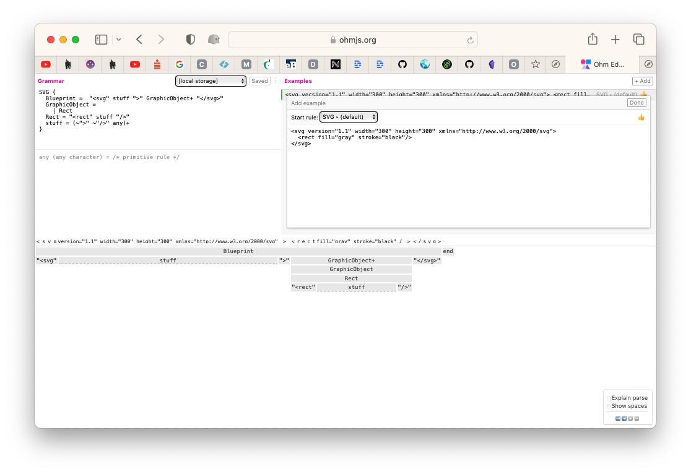
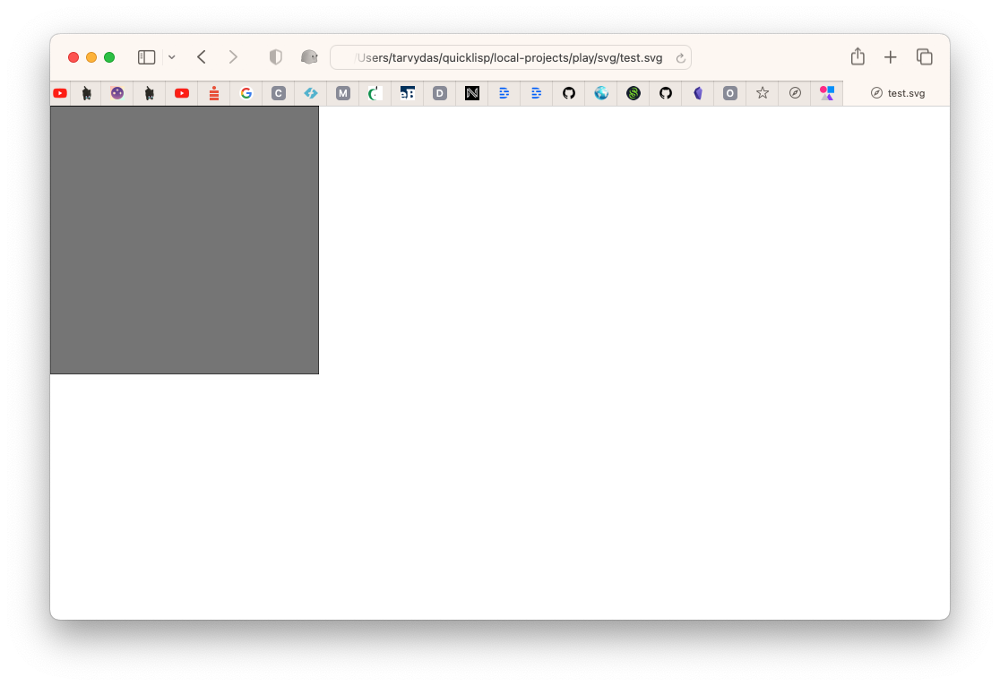

This is a trivial (very trivial) example of parsing an SVG rectangle.

The SVG is:
```
<svg version="1.1" width="300" height="300" xmlns="http://www.w3.org/2000/svg">
  <rect fill="gray" stroke="black"/>
</svg>
```

The parser is written in Ohm-JS:
```
SVG {
  Blueprint =  "<svg" stuff ">" GraphicObject+ "</svg>"
  GraphicObject =
    | Rect
  Rect = "<rect" stuff "/>"
  stuff = (~">" ~"/>" any)+
}
```

and a screenshot of the parse, in Ohm-Editor, is:


The SVG looks like this in a browser:


It is easy to extend the grammar to include more details, like x,y,width,height,fill,stroke, etc., etc.

---

I've extended the grammar in svggrammar2.ohm, and, the example in test2.svg.  

The parse succeeds only if there is one gray rectangle and one red rectangle on the diagram in that order.  

---

Ordering can be changed by editing the grammar.

Ohm's "|" alternation option makes it possible to accept rectangles in any order.

Svggrammar3.ohm and test3.svg show a way to accept multiple rectangles in any order.

---

In my mind, SVG Elements are Atoms, and characters are but Quarks.

Ohm-JS insists on having me deal with Quarks.  

I use Ohm-JS to describe Atoms and to build Molecules out of Atoms. 

Molecules can then be used to define new programming languages.
